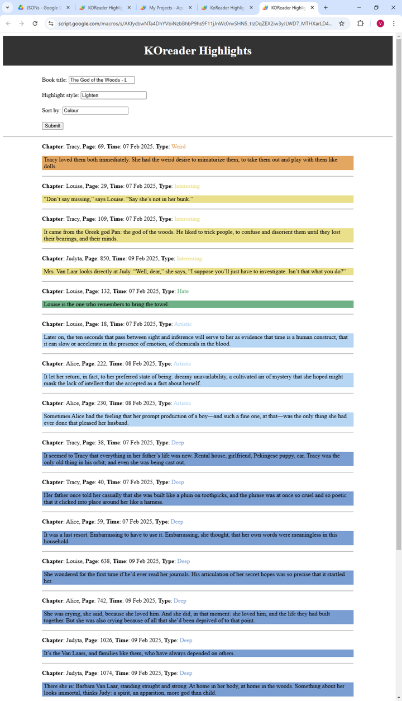

# KOReader-highlights-web-app
A Google Apps Script web app to display your KOReader highlights. This web app allows you to sort and filter the highlights that you want to see.

## Usage Instructions:
This repo contains the following Apps Scrips, saved in the Scripts subfolder:
* **Code.gs.txt:** A text file containing the Apps Script code with all of the functions. In your Apps Script Project, create a new Script file and copy the contents of this text file into it.

* **index.html.txt:** A text file containing the HTML code for the display. In your Apps Script Project, create a new HTML file and copy the contents of this text file into it.

 

## Editing:
* You will need to create a google folder. Then place the json file containing your KOReader highlights in it.
* I have set it up so that it can read in multiple files, but I haven't done anything besides accessing the first file.
* If you want more styles than just underline and lighten, you will need to add them yourself.
* You may need to change the colours to match what you have. If you would like to associate each colour with a different purpose, you can change that too
  * [Help on customising colours in KOReader here](https://www.reddit.com/r/koreader/comments/1ibqhmc/userpatch_to_customize_highlight_colors/?utm_source=share&utm_medium=web3x&utm_name=web3xcss&utm_term=1&utm_content=share_button)

## Result:

